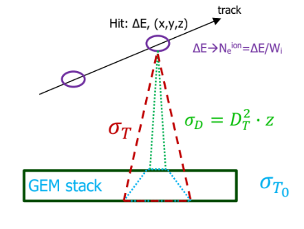

[comment]: <> (comments here)

If you want to read LaTeX expressions in this wiki-page, please use a browser extension that renders LaTeX expressions, such as:

https://chrome.google.com/webstore/detail/purple-pi/ingbbliecffofmmokknelnijicfcgolb

(source https://github.com/nschloe/purple-pi)


# Montecarlo simulation of the digitization process in CYGNO 

In this wiki page, we describe the MC simulation of the digitization process of CYGNO's events. 

## Overview on Montecarlo simulation in CYGNO

The generation of a Montecarlo (MC) event in CYGNO, is done in two parts:

### 1. Simulation of a primary particle interacting with the gas

A first part of the simulation is performed with Gean4[reference] for electron recoils (ER), and with SRIM[reference] for nuclear recoils. The output of this part of the simulation is an nTuple with information about the event, including:

- hit energy deposition $`\Delta E`$
- hit position coordinates $`x`$, $`y`$ and $`z`$ 

The code for this part of the simulation can be found here https://github.com/CYGNUS-RD/GEANT4 and here LINK_TO_SRIM_REPO

### 2. Simulation of the digitization process

A second part of the simulation is written in Python and takes the output of Geant4/SRIM as an input, and returns a 2D image: namely, a 2D histogram where each entry is the number of photons detected by the CMOS camera.

The following processes are simulated in this part:

- production of ion-eletron pairs
- drift of the electrons towards the 3-GEM stack
- electro-multiplication through the 3-GEM stack
- production of photons in the multiplication proccess
- collection of the photons on the CMOS
- electrons/photons smearing
- (saturation effect)

The digitization simulation can be found here: https://github.com/CYGNUS-RD/digitization/

In what follows, we describe the digitization simulation. 

## Digitization simulatinon model

### Production of ionization electrons

For each hit in Geant4/SRIM, the mean number of ionization electrons $`\bar{N_e}`$ produced is proportional to the energy deposition $`\Delta E`$, namely:

```math
\bar{N_e} = \frac{\Delta E}{W_i}
```

Where $`W_i`$ is the ionization potential of the gas ($`W_i = 46.2 eV/pair`$ for $`He/CF_4`$ $`60/40`$)

Thus, the actual number of ionization electrons $`{N_e}`$ is obtained  from a Poisson distribution with a mean of $`\bar{N_e}`$.

### Electrons drift

The ionization electrons will diffuse in the drift region, hence the coordinate $`x`$ and $`y`$ of each hit (and of the ionization electrons) is modified applying Gaussian fluctuations with variance [https://arxiv.org/pdf/2007.00608.pdf]:

```math
\sigma_D^2  = D_T^2 \cdot z
```
Where $`D_T^2`$ is the transverse diffusion coefficients, and $`z`$ is the distance of the hit from the first GEM.

### Electro-multiplication

When the ionization electrons arrive at the 3-GEM stack, only fluctuations of the gain of the first GEM are relevant, while the gain of the following two GEMs can be assumed to be constant. Hence, the secondary electrons produced by the first GEM are obtained from the sum of $`N_e`$ exponential distributions $`N_e^{G_1, k}`$ with mean $`G_{GEM}`$ (gain of the a GEM foil).

```math
N_e^{G1, tot} = \sum_{k}^{N_e} N_e^{G_1, k} 
```

Then, the secondary electrons go throughout the second and the third GEM foil that are assumed to have a constant gain $`G_{GEM}`$. So the total number of multiplication electrons after the third GEM foil is:

```math 
N_e^{tot} = N_e^{G1, tot} \cdot (G_{GEM})^2
```
### Photons production

Since CYGNO has an optical readout, we simulate the photons produced in the multiplication process. To do so, a conversion factor of 0.07 $`\gamma`$/e is used [reference]. The mean value of photons produced is:

```math
\bar{N_{\gamma}}^{tot} = N_e^{tot} \cdot  0.07 \; \gamma /e
```

The production of photons is obtained from a Poisson distribution with mean value $`\bar{N_{\gamma}}^{tot}`$

### Photons collection


The number of photons N_{\gamma} hitting the sensor depends on the solid angle ratio $`\Omega`$, namely:

```math  
N_{\gamma} = N_{\gamma}^{tot} \cdot \Omega
```

Where the solid angle radio is [reference]:

```math
\Omega =\frac{1}{\left(4\left(\delta+1\right)a\right)^2}
```

And $`a`$ is the aperture of the camera (?). While $`\delta`$ is the ratio between the dimension of the "object"(?) $`d_{obj}`$ and the dimension of the image $`d_{img}`$, that is:

```math
\delta = \frac{d_{obj}}{d_{img}}
```

### Photons smearing

During the electron-multiplication process, multiplication electrons (as well as photons) undergo further diffusion in the GEM structure. So the coordinates $`x`$, $`y`$ of the ionization electrons are further modified applying Gaussian fluctuations with variance $`\sigma_{T_0}`$ [reference].

To take into account both the diffusion correction due to drift procces (described earlier) and the diffusion correction due to the multiplication process, we can apply a single Gaussian fluctuation to the hit coordinates $`x`$ and $`y`$, with a variance:

```math
\sigma_T^2 = \sigma_{T_0}^2+ \sigma_D^2 
```

So, for each hit, we extract a number $`N_{\gamma}`$ of positions from a 2D Gaussian distribution around the initial hit position and with variance $`\sigma_T^2`$.


###  Saturation Effect

`The 'Saturation effect' section is currently under cunstruction...`


<br/><br/>

<div align="center"> 
  

|       | $`W_i (eV /pair)`$ | $`G_{GEM}`$ | $`\gamma/e`$ | $`\Omega`$ | $`a`$ | $`\delta`$ | $`d_{obj} (cm)`$ | $`d_{img} (cm)`$ | $`D_T (\mu m / \sqrt{cm}`$) | $`\sigma_{T_0} (\mu m)`$ |
|:-----:|:------------------:|:-----------:|:------------:|:----------:|:-----:|:----------:|:----------------:|:----------------:|:---------------------------:|:------------------------:|
| LEMON |        46.2        |     123     |      0.7     |   0.0133   |  0.95 |    18.8    |        25        |       1.33       |             130             |            300           |
|  LIME |        46.2        |     123     |      0.7     |   0.00963  |  0.95 |    26.3    |        35        |       1.33       |             130             |            300           |

**Table 1.** LEMON/LIME digitization parameters
  


<br/><br/>

  




**Figure 1.** Digitization simulation sketch


</div>


